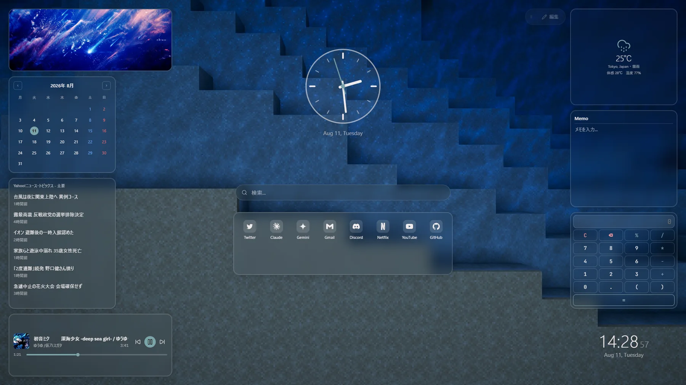

# AdvancedNewTab

ウィジェットを自由に配置できる、カスタマイズ可能な新しいタブページを提供するChrome拡張機能です。

Chromeの新規タブページを、ドラッグ&ドロップでウィジェットを組み替えられるダッシュボードに置き換えます。時計・検索・リンク集・メモといった権限不要のウィジェットに加え、よく使うサイトやブックマーク、天気、RSSフィードなど、ブラウザの機能や外部サービスと連携するウィジェットも用意しています。



## 機能

- **自由配置**: 編集モードでウィジェットをドラッグして移動、リサイズ、追加・削除・複製できます。配置はブレークポイントごとに保存され、ウィンドウ幅に応じて自動的に組み替わります。レイアウト全体も最大3枠まで保存/読込できます。
- **豊富な設定項目**: 各ウィジェットの設定はサイドパネルから変更できます。背景（単色・グラデーション・画像）、文字色、カードの透明度・角丸・ぼかしなど、見た目も細かく調整可能です。さらにウィジェット単位でも、既定の見た目のまま使うか、個別に背景色・ぼかし・暗さ・角丸・枠線を指定するかをタブで切り替えられます。
- **リンクやリストの並べ替え**: リンク集などの一覧設定は、カードを掴んでドラッグするだけで並べ替えられます（折りたたみ表示にも対応、項目が多くても見通しよく管理できます）。
- **ウィンドウリサイズへの追従**: ウィジェットはウィンドウのリサイズ中や狭い画面幅の間、時計・検索を除いて自動的に一時非表示になり、崩れた見た目が出ないようにします（ウィジェットごとにON/OFF可能）。
- **最小権限で開始**: インストール直後に要求される権限は `storage` のみです。ブックマークや閲覧履歴など、ユーザーデータへのアクセスが必要なウィジェットは、実際にそのウィジェットを配置した瞬間にだけ許可を求めます。
- **バックアップ/復元**: 設定画面から、配置・ウィジェット設定・見た目をひとつのJSONファイルにエクスポート/インポートできます。

### 同梱ウィジェット

| ウィジェット | 説明 | 必要な権限 |
| --- | --- | --- |
| 時計 | 現在時刻と日付を表示（デジタル/アナログ） | なし |
| 検索 | ブラウザの既定の検索エンジンでその場検索 | なし |
| リンク集 | 登録したサイトへのリンクをアイコン付きで表示（配置・並べ替え可） | なし（favicon表示は同梱権限） |
| メモ | 簡単なテキストメモ | なし |
| カレンダー | 月表示のシンプルなカレンダー | なし |
| カウントダウン / カウントアップ | 指定日時までの残り時間、または経過時間を表示 | なし |
| ポモドーロタイマー | 作業と休憩を交互に繰り返すタイマー | なし |
| 電卓 | 文字でもボタンでも計算できる電卓 | なし |
| 画像表示 | 1枚固定、または複数画像をシャッフル表示 | なし |
| 世界時計 | 最大4都市の現在時刻をまとめて表示 | なし |
| よく使うサイト | ブラウザの閲覧頻度データから表示 | `topSites` |
| ブックマーク | 最近追加したブックマークを表示 | `bookmarks` |
| 天気 | 指定した地名の現在の天気（[Open-Meteo](https://open-meteo.com/)提供、APIキー不要） | 該当ホストへの通信 |
| RSSフィード | 指定したRSS/Atomフィードの新着記事を表示 | 該当ホストへの通信 |
| YouTube ミニプレーヤー | YouTube / YouTube Musicの再生を操作 | 該当ホストへの通信 |

## Webブラウザ版（壁紙・スタートページ用途）

拡張機能をインストールせず、ブラウザだけでダッシュボードを試せる静的サイト版も用意しています。
`entrypoints/newtab` と全く同じアプリ（`widgets/`・`lib/`・`components/` を共有）を、拡張機能とは無関係な
素のVite設定（`vite.web.config.ts`）でビルドし、[`site/app/`](site/app) に出力します。

```bash
npm run build:web
```

- データはブラウザの `localStorage` にこの端末だけの情報として保存されます。拡張機能版とは同期しません。
- ブラウザ拡張API依存のウィジェット（よく使うサイト・ブックマーク・YouTubeミニプレーヤー・RSSフィード）は
  Web版では使えません（追加ダイアログにも出ません）。
- 紹介サイト（[`site/`](site)）と合わせてGitHub Pagesなどにそのまま公開できます。詳細は
  [`site/README.md`](site/README.md) を参照してください。

## 技術構成

- [WXT](https://wxt.dev/)（TypeScript / Manifest V3）
- React 19 + [react-grid-layout](https://github.com/react-grid-layout/react-grid-layout) v2（ドラッグ&ドロップ配置）
- [Zustand](https://github.com/pmndrs/zustand)（状態管理）
- CSS Modules + CSS Custom Properties（テーマ管理）

ウィジェットは `widgets/` 配下に1ファイル追加し、`widgets/registry.ts` に登録するだけで組み込める設計になっています。設定フォームはウィジェットごとの `settingsSchema` 宣言から自動生成されるため、ウィジェットを追加しても設定画面のUIコードを書く必要はありません。

初回起動時の既定レイアウトは `lib/defaults.ts` にハードコードされていますが、`lib/default-state.json`（既定は `null`）にオプションページの「JSONをダウンロード」で書き出した内容を貼り付けると、以後のクリーンインストール時にその内容が最初の画面になります（既存ユーザーの設定は上書きされません）。

## 開発

Node.js が必要です。

```bash
npm install
npm run dev       # 開発モード（HMR付き）
npm run build     # 本番ビルド（.output/chrome-mv3 に出力）
npm run compile   # 型チェックのみ
npm run zip       # 配布用zipの作成
npm run build:web # Webブラウザ版のビルド（site/app/ に出力。下記参照）
```

## インストール方法（Releaseからパッケージ化されていない拡張機能として読み込む）

Chrome Web Storeには公開していないため、[Releases](../../releases) から配布用のzipをダウンロードして読み込んでください。Chromium系ブラウザ（Chrome、Edge、Braveなど）であれば動作します。

1. [Releases](../../releases) ページから最新の `.zip` をダウンロードし、任意のフォルダに解凍する
2. ブラウザで拡張機能の管理ページを開く（Chromeなら `chrome://extensions`、Edgeなら `edge://extensions`）
3. 右上の「デベロッパーモード」をONにする
4. 「パッケージ化されていない拡張機能を読み込む」をクリックし、手順1で解凍してできたフォルダ（`manifest.json` が直下にあるフォルダ）を選択する
5. 拡張機能一覧に「AdvancedNewTab」が表示されれば完了

コードを変更しながら試したい場合は、`npm run build` で生成される `.output/chrome-mv3` フォルダを同様に読み込んでください（`npm run dev` を使うと変更が自動的に反映されます）。

## ライセンス

[MIT](LICENSE)
